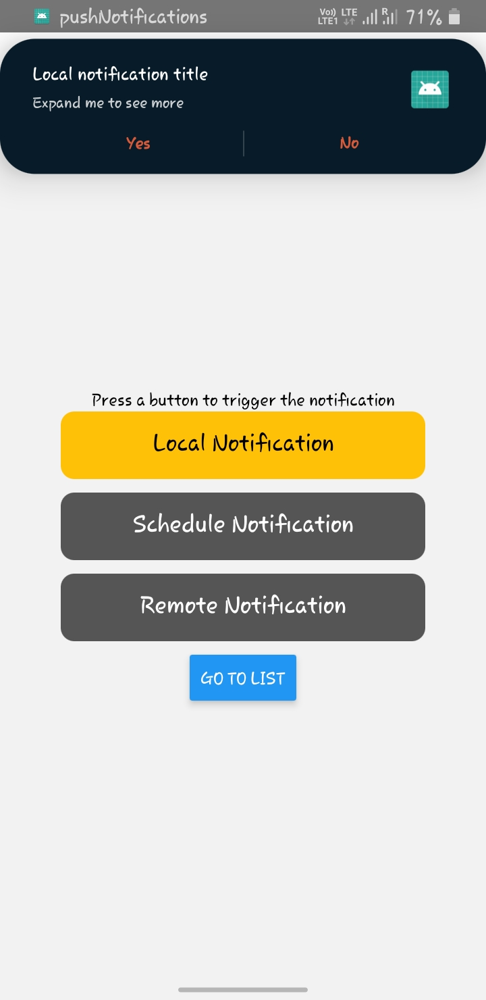

<br />
<p align="center">
  <a href="https://github.com/Adi-11/React-native-push-notifications">
    
    
    
    
  </a>

  <p align="center">
    React native push-notification Implementation
    <br />
    <a href="https://rnfirebase.io/messaging/usagee"><strong>React Native Firebase </strong></a>
    <br/>
    <a href="https://github.com/zo0r/react-native-push-notification"><strong>react-native-push-notification</strong></a>
    <br />
    <br />   ·
    <a href="https://github.com/Adi-11/React-native-push-notifications/issuess">Report Bug</a>
    ·
    <a href="https://github.com/Adi-11/React-native-push-notifications/issueses">Request Feature</a>
  </p>
</p>

<!-- ABOUT THE PROJECT -->

## About The Project

A react native project, having full and updated implementation based on latest release version of the libraries mentinoed below, for both remote and local notifications.

### Built With

- [React Native](https://reactnative.dev/)
- [React native firebase](https://reactnative.dev/)
- [React Native Push Notifications](https://github.com/zo0r/react-native-push-notification)
<!-- GETTING STARTED -->

### Prerequisites

This is an example of how to list things you need to use the software and how to install them.

- yarn
  ```sh
  npm install --global yarn
  ```
- [Setup Bare React Native environment](https://reactnative.dev/docs/environment-setup)

### Installation

2. Clone the repo
   ```sh
   git clone https://github.com/Adi-11/React-native-push-notifications
   ```
3. Install yarn packages

   ```sh
   yarn install
   yarn add react-native-push-notification
   yarn add @react-native-firebase/app
   yarn add @react-native-firebase/messaging
   ```

4. Enter your Firebase Server key in `.env` (must be in root level and refer example.env)
   ```JS
   FIREBASE_SERVER_KEY=YOUR SERVER KEY
   ```
5. Do change google-services.json file according to the [new firebase app](https://console.firebase.google.com/?pli=1).

<!-- CONTRIBUTING -->

## Contributing

Any contributions you make are **greatly appreciated**.

1. Fork the Project
2. Create your Feature Branch (`git checkout -b feature/AmazingFeature`)
3. Commit your Changes (`git commit -m 'Add some AmazingFeature'`)
4. Push to the Branch (`git push origin feature/AmazingFeature`)
5. Open a Pull Request
